[](https://github.com/fiap-2nett/hackathon/actions/workflows/dotnet.yml)

# Hackthon - Health&Med API

A Health&Med API é uma plataforma que conecta médicos e pacientes possibilitando o agendamento de consultas
de forma rápida e assertiva. A plataforma ainda possibilita aos médicos a customização de horários disponíveis
para consultas.

## Clean Architecture

O Health&Med API é altamente baseado em Clean Architecture (Arquitetura Limpa),
ou seja, projetado com foco na separação de preocupações e na dependência de
direção única, o que significa que as partes mais internas do sistema não
conhecem as partes mais externas.

Além disso o projeto mantém uma abordagem focada na modelagem de domínios
"Domain-Driven Design" (DDD), ou seja, busca alinhar o desenvolvimento da
solução com o domínio do problema, resultando em sistemas mais flexíveis,
compreensíveis e que melhor atendem às necessidades do negócio.

## Documentação de Requisitos

A documentação de Requisitos Funcionais (RF), Não Funcionais (RNF) e
entregáveis esperados neste Hackathon foi disponibilizada pelos
Stakeholders da Health&Med e pode ser encontrada em.:

[Documentação de Requisitos](https://github.com/fiap-2nett/hackathon/blob/main/doc/Hackathon%20-%20Turma%20.NET.pdf)

## Colaboradores

- [Ailton Alves de Araujo](https://www.linkedin.com/in/ailton-araujo-b4ba0520/) - RM350781
- [Bruno Fecchio Salgado](https://www.linkedin.com/in/bfecchio/) - RM350780
- [Cecília Gonçalves Wlinger](https://www.linkedin.com/in/cec%C3%ADlia-wlinger-6a5459100/) - RM351312
- [Cesar Julio Spaziante](https://www.linkedin.com/in/cesar-spaziante/) - RM351311
- [Paulo Felipe do Nascimento de Sousa](https://www.linkedin.com/in/paulo-felipe06/) - RM351707

## Tecnologias utilizadas

- .NET 7.0
- Entity Framework Core 7.0
- Swashbuckle 6.5
- FluentValidation 11.7
- FluentAssertions 6.12
- NetArchTest 1.3
- SqlServer 2019
- Docker 24.0.5
- Docker Compose 2.20

## Arquitetura, Padrões Arquiteturais e Convenções

- REST Api
- Domain-Driven Design
- EF Code-first
- Service Pattern
- Repository Pattern & Unit Of Work
- Architecture Tests
- Unit Tests

## Definições técnicas

A solução da Health&Med API é composta pelos seguintes projetos:

| Projeto                           | Descrição                                                                               |
|-----------------------------------|-----------------------------------------------------------------------------------------|
| _HealthMed.Api_                   | Contém a implementação dos endpoints de comunicação da REST Api.                        |
| _HealthMed.Application_           | Contém a implementação dos contratos de comunicação e classes de serviços.              |
| _HealthMed.Domain_                | Contém a implementação das entidades e interfaces do domínio da aplicação.              |
| _HealthMed.Infrastructure_        | Contém a implementação dos componentes relacionados a infraestrutura da aplicação.      |
| _HealthMed.Persistence_           | Contém a implementação dos componentes relacionados a consulta e persistencia de dados. |
| _HealthMed.Application.UnitTests_ | Contém a implementação dos testes unitários focados nas classes de serviço.             |
| _HealthMed.ArchitectureTests_     | Contém a implementação dos testes de arquitetura.                                       |

## Modelagem de dados

A Health&Med API utiliza o paradigma de CodeFirst através dos recursos disponibilizados pelo Entity Framework, no entanto para melhor
entendimento da modelagem de dados apresentamos a seguir o MER e suas respectivas definições:

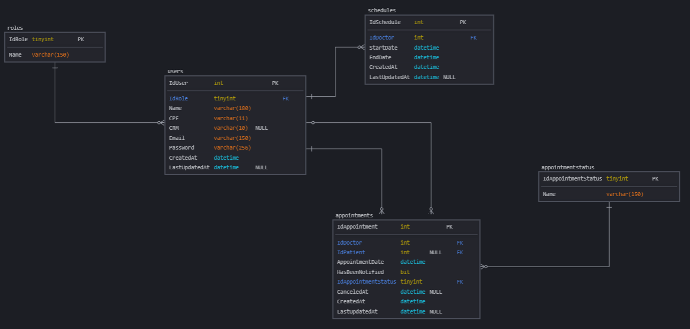

Com base na imagem acima iremos detalhar as tabelas e os dados contidos em cada uma delas:

| Schema | Tabela            | Descrição                                                                                      |
|--------|-------------------|------------------------------------------------------------------------------------------------|
| dbo    | users             | Tabela que contém os dados referentes aos usuários (médicos e pacientes da plataforma).         |
| dbo    | roles             | Tabela que contém os dados referentes aos tipos de perfis de usuário da plataforma.            |
| dbo    | schedules         | Tabela que contém os dados referentes aos horários de atendimento dos médicos.                 |
| dbo    | appointments      | Tabela que contém os dados referentes aos horários de agendamento de consultas.                |
| dbo    | appointmentstatus | Tabela que contém os dados referentes aos status de agendamentos.                              |


## Como executar

Toda a infraestrutura necessária para execução da Health&Med API
deve ser provisionada automaticamente configurando o **"docker-compose"**
como projeto de inicialização no Visual Studio.:

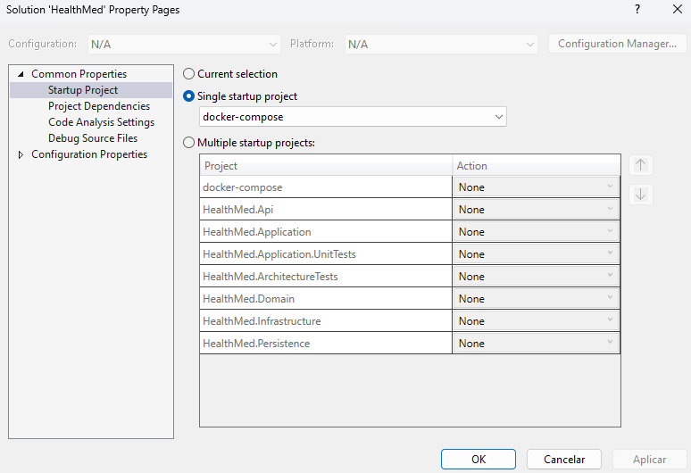

Também é possível executar a solução diretamente sem a necessidade do Visual Studio,
para tal, apenas necessitamos do Docker previamente instalado.
Para executar a solução diretamente através do Docker, abra um terminal no diretório
raíz do projeto e execute o seguinte comando:

```sh
$ docker compose up -d
```

Após rodar o projeto a iteração pode ser feita via Swagger pelo link abaixo.:

https://localhost:5001/swagger/index.html

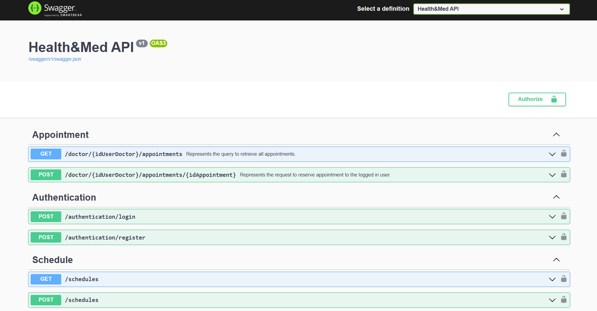


## CI/CD Pipeline

A Health&Med API disponibiliza uma CI/CD Pipeline com o objetivo de melhorar e automatizar
processos envolvidos no desenvolvimento da plataforma com foco na integração contínua do código escrito
pelos membros da equipe (CI) e a disponibilização e implantação do software em ambiente de produção (CD),
incluso neste processo a execução de Testes Unitários e Arquiteturais garantindo sempre
a integridade da solução.:

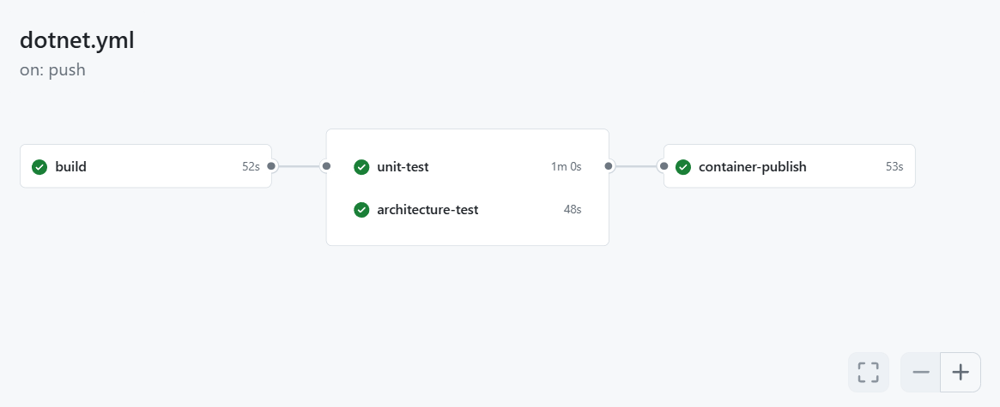

### Publicação da Imagem do Container

Além disso, a CI/CD Pipeline é responsável ainda por
realizar a publicação da imagem do Container da solução no Docker Hub.:

[Link para Imagem no Docker Hub](https://hub.docker.com/repository/docker/techchallengephase2/healthmed-api/general)

Se preferir, os testes também podem ser executados localmente via dotnet CLI. Para isso rode os comandos abaixo.:
```sh
$ dotnet test tests/HealthMed.Application.UnitTests/HealthMed.Application.UnitTests.csproj --no-build --verbosity normal
$ dotnet test tests/HealthMed.ArchitectureTests/HealthMed.ArchitectureTests.csproj --no-build --verbosity normal
```

Caso queira executar todos os projetos de teste, execute o comando:

```sh
$ dotnet test HealthMed.sln
```

Caso queria uma versão de resultado com mais detalhes, execute o seguinte comando:

```sh
$ dotnet test --logger "console;verbosity=detailed" <arquivo_do_projeto_do_teste.csproj>
```

## Casos de Uso

Abaixo temos alguns cenários disponíveis onde a plataforma Health&Med API deve 
ser utilizada.:

**ATENÇÃO**.: ***O Health&Med Portal está nos fluxos apenas para facilitar o entendimento dos Casos de Uso,
porém não foi desenvolvido visto que foge ao escopo previsto no Hackathon.
Toda interação com a plataforma deve ser validada via Swagger ou diretamente via requisições de API.***

### 1. Paciente

#### 1.1 Cadastro de Usuário

Os pacientes que desejarem aderir à plataforma Health&Med API devem
primeiro efetuar um cadastro.:

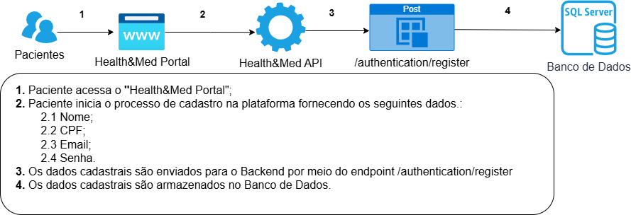

#### 1.2 Agendamento de Consultas

Os pacientes podem efetuar o agendamento de suas consultas médicas.:

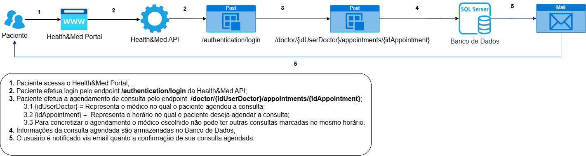

### 2.Médico

#### 2.1 Cadastro de Médico

Os médicos que desejarem atender pacientes por meio da plataforma
devem primeiro efetuar um cadastro.:

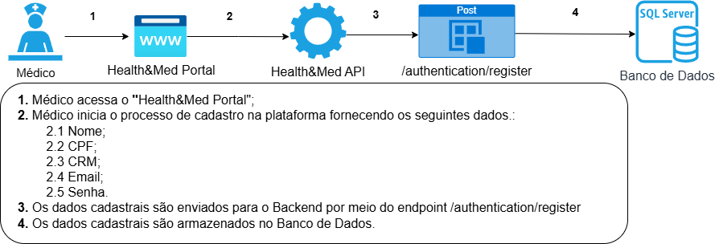

#### 2.2 Cadastro de Horário para Atendimento

Os médicos podem efetuar o cadastro de seus horários livres para atendimento.:

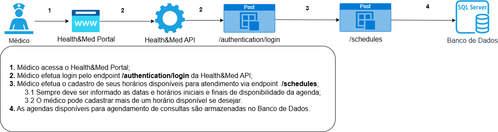

#### 2.3 Atualização de Horário para Atendimento

Os médicos podem efetuar a atualização de seus horários livres para atendimento.:

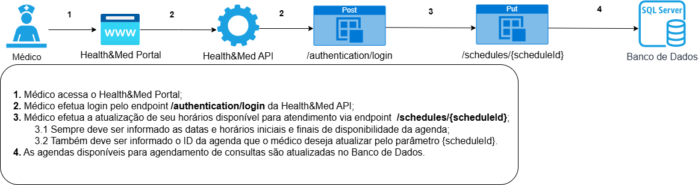

### 3. Ambos (Médicos e/ou Pacientes)

#### 3.1 Obtenção de Consultas Agendadas

Os pacientes e/ou médicos podem verificar as consultas agendadas.:

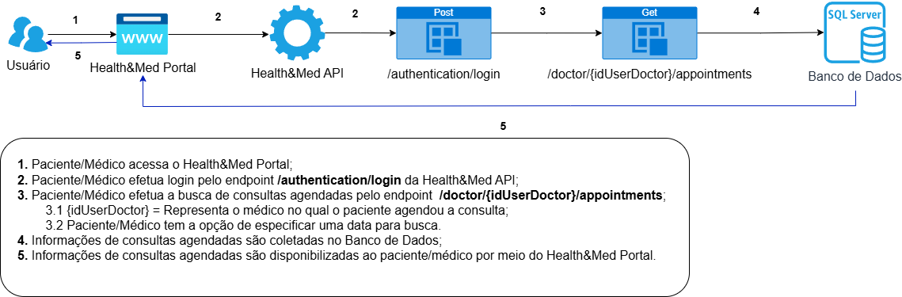

#### 3.2 Obtenção de Horários Disponíveis para Agendamento

Os pacientes e/ou médicos podem verificar os horários disponíveis para agendamento de
consultas.:

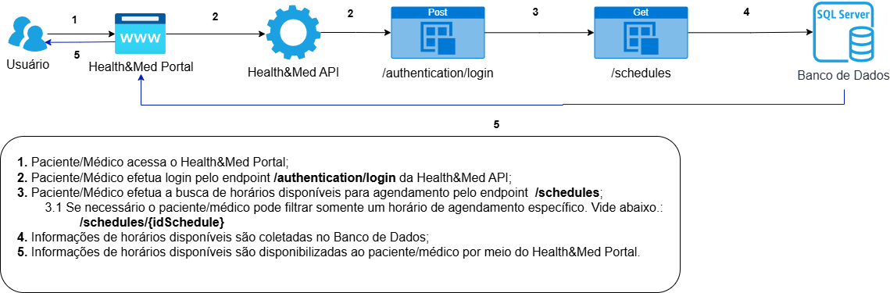

## Envio de Emails

Conforme evidenciado pelo Caso de Uso 1.2 acima a Health&Med API envia emails para
confirmar o agendamento de consultas dos pacientes.
Para ilustrar esta funcionalidade utilizamos o [Mailtrap](https://mailtrap.io/)
uma ferramenta utilizada para testar, visualizar e depurar emails
enviados por aplicações em ambientes de desenvolvimento e teste.
Ele permite que desenvolvedores verifiquem se os emails estão sendo enviados
corretamente, sem a necessidade de enviar emails reais para endereços de
usuários.

Vide abaixo um exemplo enviado via Health&Med API.:


